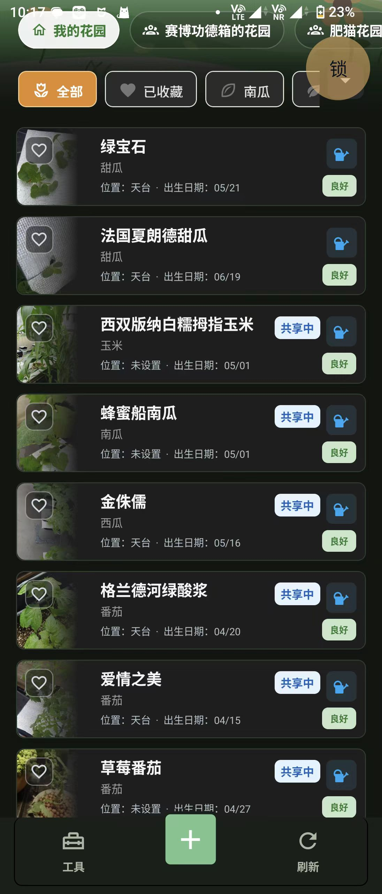

# SGplantHelper APK

这是 SGplantHelper（植物环境工作台 / 花园工具箱）的 Android APK 发布仓库，用来存放可直接安装的 Release 安装包。

## 最新版本

- 最新版本：`1.1.10`
- APK 下载：[1.1.10.apk](https://github.com/Shangyuwang11/SGplantHelper-APK/releases/download/1.1.10/1.1.10.apk)
- Release 页面：[1.1.10](https://github.com/Shangyuwang11/SGplantHelper-APK/releases/tag/1.1.10)

## 应用介绍

SGplantHelper 是一个面向家庭种植和水培记录的小工具。它可以管理本地植物档案、共享花园、浇水记录、打卡日记、水培配方、天气背景以及常用传感器工具。首页支持自己的花园和好友花园切换，并能清楚显示植物分类、收藏、共享状态和基础养护状态。

## 1.1.10 更新内容

- 打卡日记排序改为上下箭头按钮，放弃拖拽排序，手机上更稳定。
- 新增设置项：可以关闭首页天气功能，关闭后不定位、不请求天气接口。
- 首页天气继续使用 GitHub 原始 APK 更新链接，不使用加速节点链接。
- 优化首页花园列表和共享状态展示，好友花园与我的花园切换更直观。
- 水培配方库新增山崎甜椒配方。

## 安装提示

下载安装 APK 后，如果 Android 提示“未知来源应用”，请在系统设置里允许当前浏览器或文件管理器安装应用。旧版本可以直接覆盖安装，新版本会保留本地植物和设置数据。